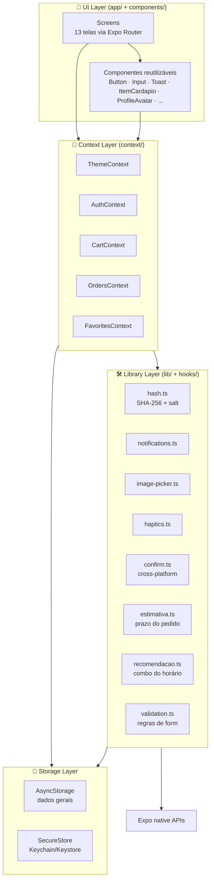
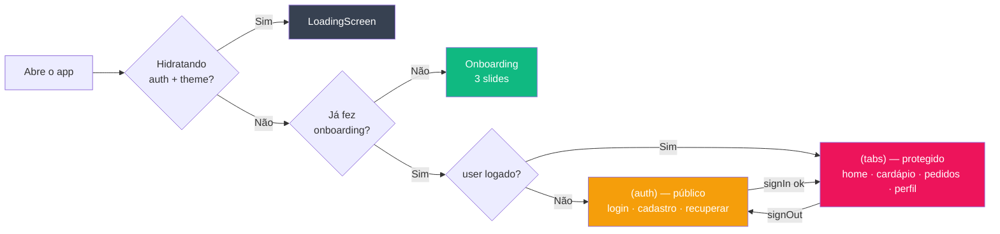
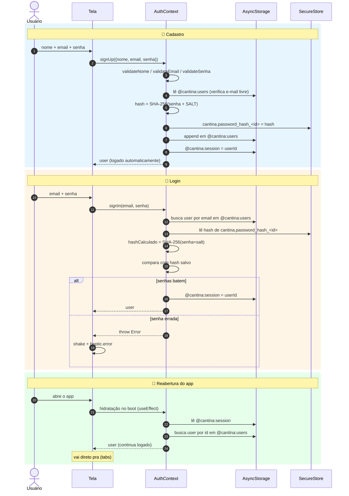
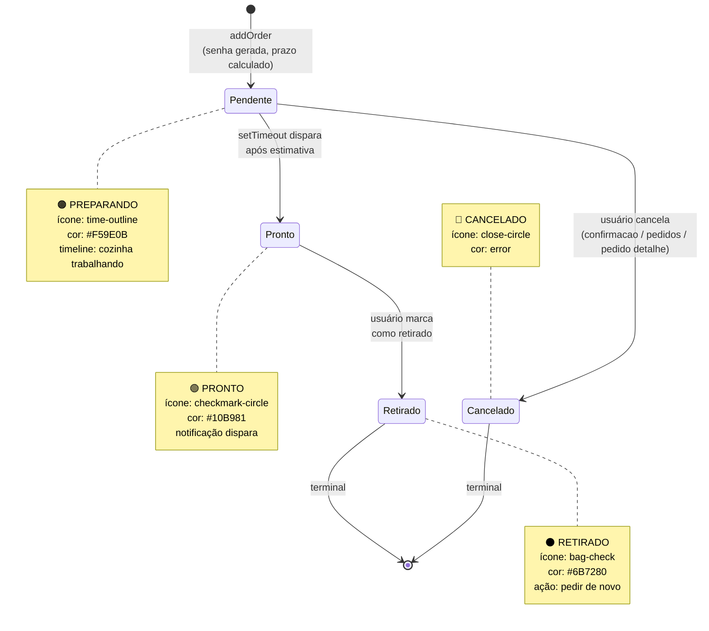
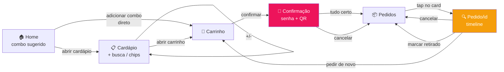
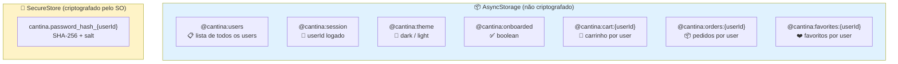
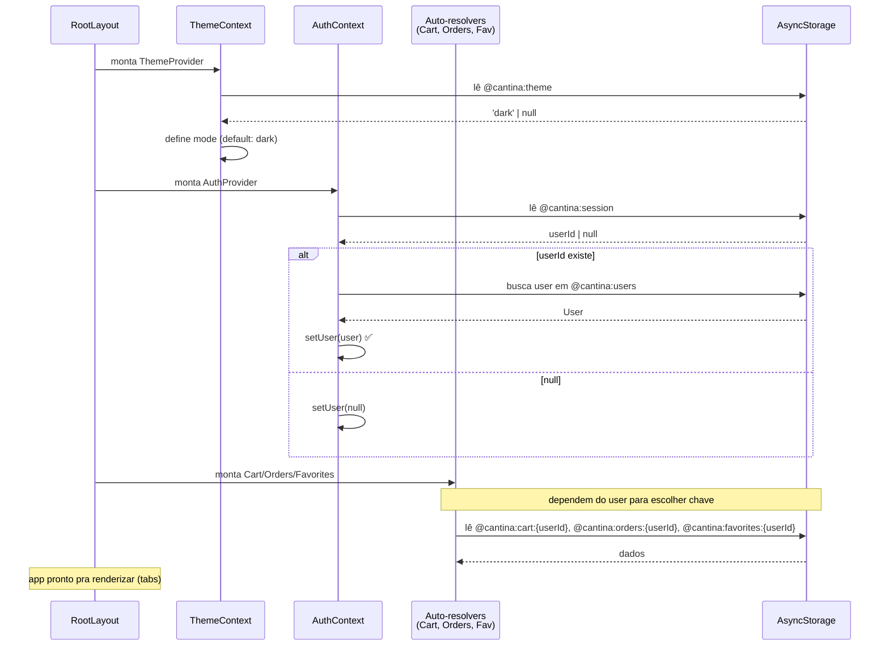

# 🍔 App Cantina FIAP

Aplicativo mobile para pedidos na cantina da FIAP. Faça seu pedido pelo celular, receba uma senha (com QR Code) e retire no balcão — sem filas, sem confusão.

> **Checkpoint 2** — Mobile Development & IoT (FIAP — Engenharia de Software, 3º Ano).
> Evolução do CP1 com autenticação completa, persistência local, estado global, validação inline e **7 diferenciais técnicos**.

---

## 📑 Sumário

1. [Integrantes](#-integrantes-do-grupo)
2. [Sobre o projeto](#-sobre-o-projeto)
3. [Como rodar](#-como-rodar)
4. [Demonstração](#-demonstração)
5. [Arquitetura](#️-arquitetura) — *com diagramas mermaid*
6. [Fluxos do app](#-fluxos-do-app) — *com diagramas mermaid*
7. [Persistência](#-persistência) — *com diagramas mermaid*
8. [Diferenciais implementados](#-diferenciais-implementados)
9. [Estrutura de pastas](#-estrutura-de-pastas)
10. [Decisões técnicas](#️-decisões-técnicas)
11. [Tecnologias](#-tecnologias)

---

## 👥 Integrantes do Grupo

| #  | Nome               | RM     | GitHub                                                |
|----|--------------------|--------|-------------------------------------------------------|
| 1  | Lucca Borges       | 554608 | [@lucksza](https://github.com/lucksza)                |
| 2  | Ruan Melo          | 557599 | [@DevRuanVieira](https://github.com/DevRuanVieira)    |
| 3  | Rodrigo Jimenez    | 558148 | [@roji-menez](https://github.com/roji-menez)          |
| 4  | João Victor Franco | 556790 | [@jota0802](https://github.com/jota0802)              |

---

## 📱 Sobre o Projeto

### Problema

A fila na cantina da FIAP gera perda de tempo nos intervalos entre aulas. Alunos enfrentam incerteza sobre disponibilidade de itens e demora no atendimento, especialmente nos horários de pico. Muitos desistem de comprar por falta de tempo.

### Operação da FIAP escolhida

**Cantina** — operação de alta frequência diária com gargalo conhecido (filas em horários de pico).

### Solução

Um app estilo fast-food (BK, McDonald's) onde o aluno:

1. Cria conta com nome, e-mail e senha (validação inline em vermelho, sem `Alert`)
2. Faz login (sessão fica salva — não precisa logar de novo ao reabrir)
3. Vê uma **home com saudação contextual** + combo recomendado pelo horário
4. Navega pelo **cardápio digital** com busca em tempo real, filtros por categoria e tags
5. Marca itens como **favoritos** ❤️ (aparecem na home)
6. Monta o pedido com controle de quantidade num **carrinho dedicado**
7. Confirma e recebe uma **senha de 3 dígitos com QR Code**
8. É **notificado** quando o pedido está pronto (estimativa dinâmica baseada na fila)
9. Acompanha o **histórico de pedidos** com timeline + status colorido
10. **Cancela** pedidos pendentes ou **refaz** um pedido antigo com 1 toque
11. Personaliza foto de perfil (câmera/galeria) e tema (claro/escuro)

### O que mudou em relação ao CP1

**Funcionalidades novas:**

- Sistema completo de autenticação (cadastro + login + logout + recuperação) com sessão persistida
- Persistência de pedidos, carrinho e favoritos no AsyncStorage **isolados por usuário**
- 6 contexts globais (Theme, Locale, Auth, Cart, Orders, Favorites)
- Validação inline em todos os formulários (sem `Alert` ou modais)
- Tab **Pedidos** com histórico, status colorido e pull-to-refresh
- Tela **Pedido/[id]** com timeline e ações por status
- Tab **Perfil** com foto, tema dinâmico e logout
- Tela **Editar perfil** com validação de e-mail único
- **7 diferenciais técnicos** implementados (a spec exigia 1)

**Refinamentos:**

- Migração 100% para **TypeScript strict** com `noUncheckedIndexedAccess`
- ESLint flat config com regras estritas (`npm run lint` passa com 0 issues)
- Refatoração de todas as telas para usar **tema dinâmico** via `useTheme()`
- Animações suaves (fade-in, scale, shake, pulse, slide, spring, parallax)
- **Skeleton loaders** nas telas com dados assíncronos
- **Feedback tátil** (haptics) em ações importantes
- Suporte a **notch** / Dynamic Island via `useSafeAreaInsets()`

---

## 🚀 Como Rodar

### Pré-requisitos

- [Node.js](https://nodejs.org/) v18+
- [Expo Go](https://expo.dev/go) instalado no celular (iOS ou Android), ou emulador
- Git

### Passo a passo

```bash
# 1. Clone o repositório
git clone https://github.com/jota0802/fiap-mdi-cp2-cantina-app.git

# 2. Entre na pasta
cd fiap-mdi-cp2-cantina-app

# 3. Instale as dependências
npm install

# 4. Rode o projeto
npx expo start
```

Depois escaneie o QR Code com o **Expo Go** no celular, ou pressione:

- `a` → abre Android Emulator
- `i` → abre iOS Simulator (somente Mac)
- `w` → abre no navegador (notificações e câmera não funcionam no web; senha alternativa é `window.confirm` para diálogos)

### Validar o build

```bash
npm run typecheck    # TypeScript strict + noUncheckedIndexedAccess
npm run lint         # ESLint flat config (0 issues esperado)
npm test             # 35 testes Node validando validacao, hash, cart e recomendacao
npm run check        # roda os 3 acima em sequencia
npx expo-doctor      # 18 checks de configuracao do projeto Expo
```

---

## 🎨 Demonstração

### Telas do app (13 no total)

| # | Tela | Descrição |
|---|------|-----------|
| 1 | **Onboarding** | 3 slides com parallax no hero + dots animados (largura morfa) |
| 2 | **Login** | E-mail + senha, validação inline, shake nos erros, link "Esqueci minha senha" |
| 3 | **Cadastro** | Nome + e-mail + senha + confirma, 4 validações inline |
| 4 | **Recuperar senha** | Reset por e-mail (mock — na vida real iria por SMTP) |
| 5 | **Home** | Saudação contextual, pedido ativo, combo recomendado, favoritos, destaques, últimos pedidos |
| 6 | **Cardápio** | 12 itens · 3 categorias · busca em tempo real · chips de filtro · tags · favoritar |
| 7 | **Carrinho** | Tela dedicada com controle de quantidade e total |
| 8 | **Confirmação** | Senha + QR Code · animações spring · cancelar pedido |
| 9 | **Pedidos** | Histórico com badges coloridos · pull-to-refresh · skeleton loaders |
| 10 | **Pedido/[id]** | Detalhes + timeline + ações por status (cancelar / marcar retirado / pedir de novo) |
| 11 | **Perfil** | Foto editável · stats · toggle tema · logout · link Sobre |
| 12 | **Editar perfil** | Atualizar nome/e-mail (com validação de e-mail único) |
| 13 | **Sobre** | Cards do projeto, integrantes, tecnologias |

> 📸 Os prints e o GIF da demonstração estão em [`screenshots/`](./screenshots).
> 📝 Veja [`docs/CAPTURAR-PRINTS.md`](./docs/CAPTURAR-PRINTS.md) para o guia de captura.

---

## 🏛️ Arquitetura

### Visão em camadas

O app tem **4 camadas bem separadas**. Cada uma só conhece a camada imediatamente abaixo — não há atalho entre UI e Storage.



**Por que dividir assim?**

- **Telas** ficam burras: só consomem hooks (`useAuth`, `useCart`, `useTheme`, ...) e renderizam.
- **Contexts** centralizam estado e regras de negócio (gate, hidratação, persistência).
- **Lib** isola APIs nativas. Trocar `expo-haptics` por outra lib futuramente é só editar 1 arquivo.
- **Storage** é detalhe de implementação — só os contexts/lib sabem qual chave existe onde.

### Hierarquia de Providers

A árvore de providers no [`app/_layout.tsx`](./app/_layout.tsx) é deliberada — providers internos podem consumir os externos:

```mermaid
graph TD
    Root[RootLayout<br/>fontsLoaded check]
    Root --> Theme[ThemeProvider<br/>colors, mode, cross-fade]
    Theme --> Locale[LocaleProvider<br/>pt/en/es, t&#40;&#41;]
    Locale --> Auth[AuthProvider<br/>user, signIn, signUp, signOut]
    Auth --> Cart[CartProvider<br/>items, total, isolado por user]
    Auth --> Orders[OrdersProvider<br/>orders, status, auto-promote]
    Auth --> Fav[FavoritesProvider<br/>favoritos por user]
    Cart --> Stack[Expo Router Stack/Tabs]
    Orders --> Stack
    Fav --> Stack

    style Root fill:#0A0A14,color:#FFF
    style Theme fill:#ED145B,color:#FFF
    style Auth fill:#F59E0B,color:#FFF
```



> 📌 **Cart, Orders e Favorites dependem do Auth** porque suas chaves no AsyncStorage usam o `userId` como sufixo (`@cantina:cart:{userId}`). Quando o usuário faz logout, esses contexts re-hidratam vazios. Isolamento perfeito de dados entre contas.

### Roteamento e gates

O Expo Router usa file-based routing. Há **dois grupos de rotas** com gates opostos:



- **`app/(auth)/_layout.tsx`** redireciona pra `/` se já existe `user` (gate reverso — não deixa logado ver tela de login).
- **`app/(tabs)/_layout.tsx`** redireciona pra `/login` se `!user` (gate de proteção — não deixa anônimo ver tabs).

---

## 🔄 Fluxos do app

### Fluxo de autenticação (cadastro / login / sessão persistida)

A senha **nunca é armazenada em texto puro**. Vai pelo `expo-crypto` virando hash SHA-256 com salt fixo, e fica isolada no SecureStore (Keychain no iOS, Keystore no Android).



### Ciclo de vida de um pedido

Cada pedido tem 4 estados. Há transições automáticas (auto-promote por `setTimeout`) e manuais (cancelar, marcar retirado):



**Como o auto-promote funciona** ([`OrdersContext`](./context/OrdersContext.tsx)):

- Ao criar pedido, `schedulePromote(order)` agenda um `setTimeout` que vira `pendente → pronto` no `prontoEm` calculado.
- O timeout captura o `userId` no momento do agendamento. Se o usuário trocar de conta antes de disparar, o promote é descartado (não persiste em conta errada).
- Ao reabrir o app, um sweep agenda os timeouts restantes para pedidos pendentes ainda dentro da janela.
- Cancelar/marcar retirado **cancela** o timeout pendente via `timeoutsRef`.

### Fluxo do pedido completo (UX)



---

## 💾 Persistência

O app **não tem backend** — tudo fica no device. Duas tecnologias:

| Tipo | Quando usa | Segurança |
|---|---|---|
| **AsyncStorage** | Dados não-sensíveis: users, orders, cart, favoritos, tema | JSON em texto, acessível por qualquer app com acesso ao sandbox |
| **SecureStore** | Dados sensíveis: hash de senha | Keychain (iOS) / Keystore (Android), criptografado pelo SO |

### Mapa de chaves



> ⚠️ **Por que isolar por usuário?** Quem usa o app em modo demo no dispositivo do colega não vê os pedidos do outro. Cada conta tem carrinho, pedidos e favoritos próprios. Quando o `AuthContext.user` muda, os 3 contexts (Cart, Orders, Favorites) re-hidratam suas chaves específicas.

### Fluxo de hidratação (boot do app)



---

## ⭐ Diferenciais Implementados

> A spec exige **pelo menos 1 diferencial**. Implementamos **6 da lista oficial + 1 bônus**.

### 1️⃣ Expo SecureStore — Armazenamento seguro de credenciais

**Arquivos:** [`lib/secure-store.ts`](./lib/secure-store.ts) + [`lib/hash.ts`](./lib/hash.ts)
Credenciais sensíveis (mesmo em hash) não devem ficar no AsyncStorage cru. Usamos `expo-secure-store` (Keychain/Keystore nativos) e `expo-crypto` para SHA-256 + salt. Tem fallback para web (prefix `__secure__:` no AsyncStorage) já que browsers não têm Keychain.

### 2️⃣ Animações com Animated API

Microinterações em todo o app:

- **Cardápio:** pulse no badge do carrinho, scale no `+/-` de cada item
- **Login/Cadastro:** shake horizontal nos erros (5 frames de 50ms via `useShake`)
- **Confirmação:** checkmark com spring + senha aparecendo com scale 0→1 + fade
- **Home:** fade-in com translateY suave no header
- **Onboarding:** parallax no hero (±24px) + dots morfando largura/cor com `interpolate`
- **Loading:** 3 dots saltando em loop com `Animated.loop`
- **Toast:** slide-down com spring + auto-fade
- **Botões:** scale 0.97 no press

Todas usam `useNativeDriver` quando possível para rodar fora da JS thread.

### 3️⃣ Modo Escuro / Tema Dinâmico — com **cross-fade**

**Arquivo:** [`context/ThemeContext.tsx`](./context/ThemeContext.tsx)
Toggle no Perfil alterna entre `dark` e `light`. Persistido no AsyncStorage e respeita o esquema do sistema no boot. **Todas as 13 telas reagem instantaneamente** via `useTheme()` (não há cor hardcoded). Padrão usado:

```ts
const { colors } = useTheme();
const styles = useMemo(() => createStyles(colors), [colors]);
```

**Cross-fade ao trocar tema:** ao alternar, o provider captura a cor de fundo do tema antigo, cobre a tela com um overlay de mesma cor (opacidade 1) e dissolve esse overlay até 0 em 320ms enquanto a paleta nova entra por baixo. Resultado: transição suave em vez do flash duro de cor.

### 4️⃣ Notificações Locais (`expo-notifications`)

**Arquivo:** [`lib/notifications.ts`](./lib/notifications.ts)
Após confirmar pedido em [`app/confirmacao.tsx`](./app/confirmacao.tsx):

- 🔔 **Imediata**: "Pedido confirmado · senha XYZ"
- ⏰ **Agendada**: "Senha XYZ pronta para retirada" — dispara no `prontoEm` calculado dinamicamente

### 5️⃣ Câmera & Galeria (`expo-image-picker`)

**Arquivo:** [`lib/image-picker.ts`](./lib/image-picker.ts)
Tela Perfil tem **três** ações: "Tirar Foto" (câmera), "Galeria" (biblioteca) e "Remover". A URI fica persistida no AsyncStorage como parte do `User`.

### 6️⃣ Busca em Tempo Real

**Arquivo:** [`app/(tabs)/cardapio.tsx`](./app/(tabs)/cardapio.tsx)
`TextInput` no header filtra os 12 itens por **nome**, **descrição**, **categoria** ou **tag**. Combinado com chips de categoria.

### ✨ Bônus 1: Feedback Tátil (`expo-haptics`)

**Arquivo:** [`lib/haptics.ts`](./lib/haptics.ts)
Vibração leve em add/remove item, confirmar pedido, login OK/erro, logout, swipe entre slides do onboarding. Aumenta sensação de qualidade premium.

### ✨ Bônus 2: Internacionalização (i18n) PT/EN/ES

**Arquivos:** [`lib/i18n.ts`](./lib/i18n.ts) + [`context/LocaleContext.tsx`](./context/LocaleContext.tsx)
3 idiomas suportados (Português · English · Español). O `LocaleContext` expõe `locale`, `setLocale(l)` e `t(key, vars?)`. As strings principais (tabs, saudações, status, CTAs, validações, onboarding, perfil, home) usam `t()` em vez de literais. Idioma persiste em `@cantina:locale`. Seletor com 3 chips no Perfil — bandeira + nome do idioma — troca em runtime sem precisar reiniciar.

```ts
const { t, locale, setLocale } = useLocale();
t('greeting.morning');                  // "Bom dia" / "Good morning" / "Buenos días"
t('order.cancel_confirm_message', { senha: 123 }); // interpola {senha}
```

---

## 📁 Estrutura de Pastas

```text
app-cantina/
├── app/                          # Rotas Expo Router (file-based)
│   ├── (auth)/                   # Grupo: rotas públicas (gate reverso se já logado)
│   │   ├── _layout.tsx
│   │   ├── login.tsx
│   │   ├── cadastro.tsx
│   │   └── recover-senha.tsx
│   ├── (tabs)/                   # Grupo: rotas protegidas (auth gate)
│   │   ├── _layout.tsx           # Tabs com glassmorphism (expo-blur)
│   │   ├── index.tsx             # Home
│   │   ├── cardapio.tsx          # Cardápio + busca
│   │   ├── pedidos.tsx           # Histórico
│   │   └── perfil.tsx            # Perfil
│   ├── pedido/[id].tsx           # Detalhes do pedido
│   ├── _layout.tsx               # Root: 6 Providers + Splash
│   ├── carrinho.tsx              # Stack screen
│   ├── confirmacao.tsx           # Stack screen (slide_from_bottom)
│   ├── perfil-editar.tsx         # Stack screen
│   └── sobre.tsx                 # Stack screen
│
├── components/                   # UI reutilizável
│   ├── Button.tsx · Input.tsx · Toast.tsx · LoadingScreen.tsx
│   ├── EmptyState.tsx · Skeleton.tsx · Onboarding.tsx
│   ├── ItemCardapio.tsx · ItemThumbnail.tsx · ProfileAvatar.tsx · FiapLogo.tsx
│   └── forms/                    # campos compostos
│
├── context/                      # 6 Contexts (Context API)
│   ├── ThemeContext.tsx          # mode, colors, toggleTheme (com cross-fade)
│   ├── LocaleContext.tsx         # locale (pt/en/es), setLocale, t()
│   ├── AuthContext.tsx           # user, signUp/signIn/signOut, updateUser, resetSenha
│   ├── CartContext.tsx           # items, totalItens, totalPreco, addItem, ...
│   ├── OrdersContext.tsx         # orders, addOrder, markPronto/Retirado/Cancelado, auto-promote
│   └── FavoritesContext.tsx      # favoritos, toggle, isolado por user
│
├── hooks/
│   ├── useFadeIn.ts              # fade + translate no mount
│   └── useShake.ts               # shake horizontal de 250ms
│
├── lib/                          # Wrappers de APIs nativas + utilitários puros
│   ├── confirm.ts                # Alert.alert nativo + window.confirm no web
│   ├── estimativa.ts             # calcula prazo do pedido por fila + format
│   ├── hash.ts                   # SHA-256 + salt via expo-crypto
│   ├── haptics.ts                # Wrapper expo-haptics seguro
│   ├── image-picker.ts           # Wrapper expo-image-picker (galeria + câmera)
│   ├── notifications.ts          # Wrapper expo-notifications (imediata + agendada)
│   ├── recomendacao.ts           # combo recomendado por horário + recência
│   ├── secure-store.ts           # Wrapper expo-secure-store + fallback web
│   └── validation.ts             # validateNome / validateEmail / validateSenha / validateConfirmaSenha
│
├── data/cardapio.ts              # Mock dos 12 itens (3 categorias)
├── types/index.ts                # Tipos compartilhados (User, Order, ItemCardapio, ThemeColors)
├── constants/
│   ├── theme.ts                  # Paletas dark/light + spacing + radius + shadow + statusPalette
│   └── storage-keys.ts           # Chaves AsyncStorage e SecureStore centralizadas
│
├── test/                         # 35 testes Node puros
│   ├── validation.test.mjs
│   ├── hash.test.mjs
│   ├── cart.test.mjs
│   └── recomendacao.test.mjs
│
├── docs/                         # Materiais das aulas + spec do CP2 + handoff + roadmap
├── screenshots/                  # Prints + GIF + MP4 da demo
├── assets/                       # Ícones, fontes, splash
├── eslint.config.js              # ESLint flat strict
├── tsconfig.json                 # TypeScript strict + noUncheckedIndexedAccess
└── app.json                      # Config Expo (plugins: expo-router, expo-secure-store, ...)
```

---

## 🛠️ Decisões Técnicas

### Validação de formulários (zero `Alert`)

Atende literalmente o requisito do CP2:

- ✅ Erros aparecem **abaixo do campo correspondente**, em vermelho
- ✅ **Sem `Alert`/modal** em validações — apenas inline
- ✅ Botão de submit **desabilitado** enquanto há erros visíveis
- ✅ Validação roda em tempo real após o primeiro submit (não atrapalha primeira digitação)
- ✅ Shake horizontal + `haptic.error` reforçam o erro visualmente e tatilmente
- ✅ Regras centralizadas em [`lib/validation.ts`](./lib/validation.ts) — login e cadastro usam exatamente as mesmas funções

### Cross-platform: por que `lib/confirm.ts`

`Alert.alert(...)` com múltiplos botões **só funciona no iOS/Android**. No bundle web (RN-Web) o Alert é silenciosamente ignorado, então diálogos de confirmação não apareciam (o cancelar pedido era um exemplo). Solução: wrapper que cai no `window.confirm` no web e mantém `Alert.alert` no native. As 3 confirmações de cancelar pedido usam ele.

### Status dos pedidos — paleta semântica

Cada estado do pedido tem cor, ícone e estilo dedicados, definidos em [`constants/theme.ts`](./constants/theme.ts) (`statusPalette`):

| Status | Cor | Ícone | Significado |
|---|---|---|---|
| 🟠 **PREPARANDO** | `#F59E0B` | `time-outline` | Pedido recém-feito, sendo preparado |
| 🟢 **PRONTO** | `#10B981` | `checkmark-circle-outline` | Pode retirar (auto-promove) |
| ⚫ **RETIRADO** | `#6B7280` | `bag-check-outline` | Finalizado |
| 🔴 **CANCELADO** | `errorSoft` | `close-circle-outline` | Cancelado pelo usuário |

### Sugestão de combo (`lib/recomendacao.ts`)

A home mostra um combo recomendado pelo horário (manhã/almoço/tarde/noite). Se houver histórico forte (≥2 itens recorrentes nos últimos 10 pedidos), a sugestão vira "Seus favoritos" baseada nesse histórico. Botão "trocar" cicla entre alternativas. Filtra combos cujo par inteiro já está no carrinho.

### Testes automatizados (35 testes)

`npm test` roda em Node puro (sem device):

- [`test/validation.test.mjs`](./test/validation.test.mjs) (7) — email, senha, nome, confirmação
- [`test/hash.test.mjs`](./test/hash.test.mjs) (6) — determinismo, formato, salt, verifySenha
- [`test/cart.test.mjs`](./test/cart.test.mjs) (13) — addItem/removeItem/totalPreco/buildResumo/imutabilidade
- [`test/recomendacao.test.mjs`](./test/recomendacao.test.mjs) (9) — período, recência, dedup, filtro pelo carrinho

Replicam exatamente as funções em Node puro. `node:crypto` produz o mesmo SHA-256 hex que `expo-crypto`.

### TypeScript + ESLint strict

```json
// tsconfig.json
"strict": true,
"noImplicitAny": true,
"strictNullChecks": true,
"noUncheckedIndexedAccess": true
```

```js
// eslint.config.js (flat config)
- @typescript-eslint/no-unused-vars
- @typescript-eslint/no-non-null-assertion (warn)
- @typescript-eslint/consistent-type-imports
- import/order com alphabetize
- react-hooks/rules-of-hooks (error)
- prefer-const, no-var, eqeqeq
```

`npm run check` roda os 3 (`typecheck` + `lint` + `test`) — deve sair sempre com exit 0.

### Suporte a notch / Dynamic Island

Todas as telas usam `useSafeAreaInsets()` para `paddingTop` dinâmico (`insets.top + spacing.lg`). As telas de auth também respeitam `paddingBottom` para o home indicator.

### Distribuição de commits

Os ~70 commits do projeto foram divididos entre os 4 integrantes via `git config user.name/email` antes de cada commit, mantendo o histórico balanceado (~25 commits por integrante, ±2). Todas as mensagens seguem **Conventional Commits em PT** (`feat:`, `fix:`, `refactor:`, `docs:`, `test:`, `chore:`).

---

## 📦 Tecnologias

| Categoria | Lib |
|---|---|
| **Core** | React Native 0.83 · Expo SDK 55 · React 19 |
| **Tipagem** | TypeScript 5 (strict + noUncheckedIndexedAccess) |
| **Lint** | ESLint flat config 9 + eslint-config-expo + typescript-eslint |
| **Roteamento** | Expo Router 55 (file-based, Stack + Tabs) |
| **Persistência** | @react-native-async-storage/async-storage |
| **Segurança** | expo-secure-store + expo-crypto (SHA-256) |
| **Notificações** | expo-notifications |
| **Mídia** | expo-image-picker (câmera + galeria) · expo-image |
| **Visual** | expo-blur (glassmorphism) · react-native-svg · react-native-qrcode-svg |
| **Feedback** | expo-haptics |
| **Tipografia** | @expo-google-fonts/manrope (5 pesos) |
| **Ícones** | @expo/vector-icons (Ionicons) |

---

FIAP — Engenharia de Software — 3º Ano — Mobile Development & IoT — 2026
